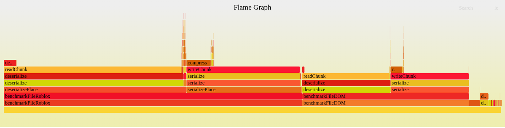

# luauperf

Flame graph generator for perf profiles. Ported from the Luau `perfgraph.py` and `perfstat.py` tool.

## Usage

### Graph:
```bash
zune run perf graph <input.out> [output.html]
```

### Stats:
```bash
zune run perf stats <input.out>
```

## Example Flame Graph


_example performance profle generated by zune while running a simple [luau-roblox](https://github.com/Scythe-Technology/luau-roblox) benchmark_